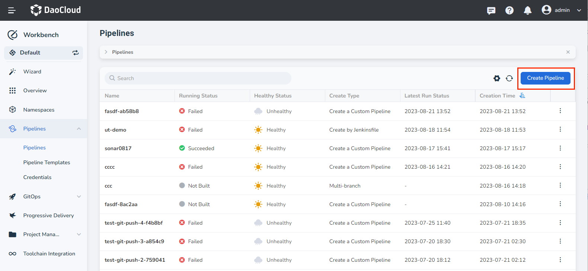
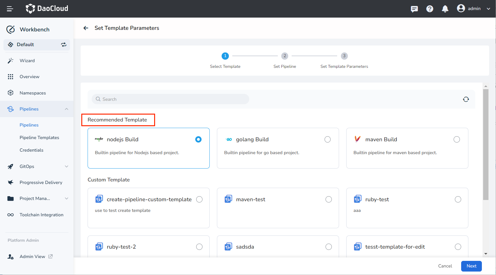
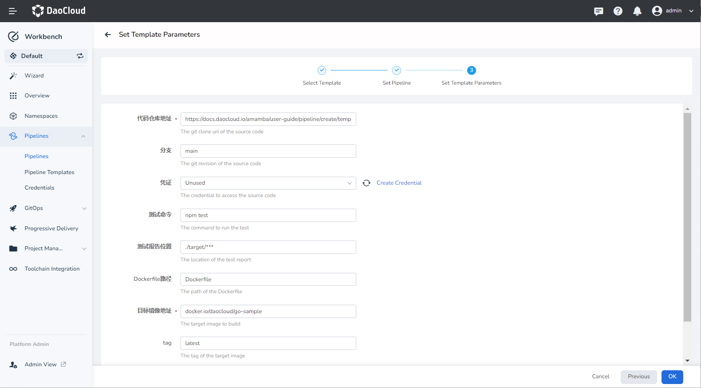
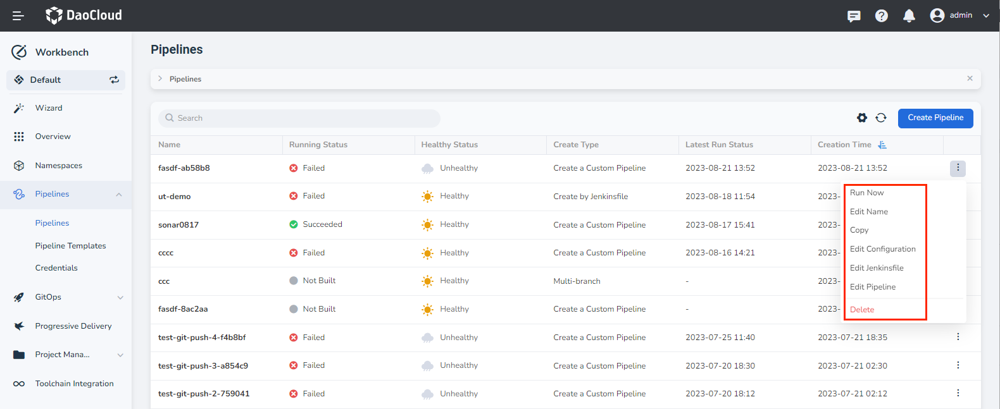

# Create a Pipeline from Template

Workbench module supports quick creation of pipelines based on built-in templates or user-defined [custom templates](../template/custom-template.md). According to common use cases, Workbench module has built-in Golang, Nodejs, and Maven templates.

## Steps

The steps to create a pipeline based on a built-in template are as follows:

1. Click __Create Pipeline__ on the pipeline list page.

    

2. In the dialog box that pops up, select __Create from Template__ and click __OK__ .

    

3. Select the appropriate pipeline template and click __Next__ .

    > All built-in templates are listed under the __Recommended Template__ heading, and all custom templates created by users are listed under the __Custom Template__ heading.

    

4. Fill in the pipeline configuration by referring to [custom pipeline creation](custom.md), and then click __Next__ .

5. Fill in the template parameters by referring to the following instructions, and then click __OK__ .

    - Repo URL: the address of the remote code warehouse, required
    - Branch: The code of which branch is used to build the pipeline, required
    - Credentials: If it is a private warehouse, you need to [create a credential](../credential.md) in advance and select the credential here
    - Test Command: unit test command

        > If using a Golang template, the test command defaults to __go test -v -coverprofile=coverage.out__
        > If using Nodejs template, the test command defaults to __npm test__
        > If using a Maven template, the test command defaults to __mvn -B test -Dmaven.test.failure.ignore=true__

    - Test Report Location: where the test report is located and analyzed to generate a test report
    - Dockerfile Path: the absolute path of the Dockerfile in the code warehouse, required
    - Target mirror address: enter the name of the mirror warehouse, required
    - Tag: Add a tag to the newly generated image after running this pipeline
    - Container registry credentials: Credentials for accessing the mirror repository. If it is a private warehouse, you need to [create a credential](../credential.md) in advance and select the credential here

    

6. After the creation is complete, you can view the newly created pipeline in the pipeline list. Click the More Operations button on the right side of the pipeline to perform operations such as execution, editing, and duplication of the pipeline.

    
