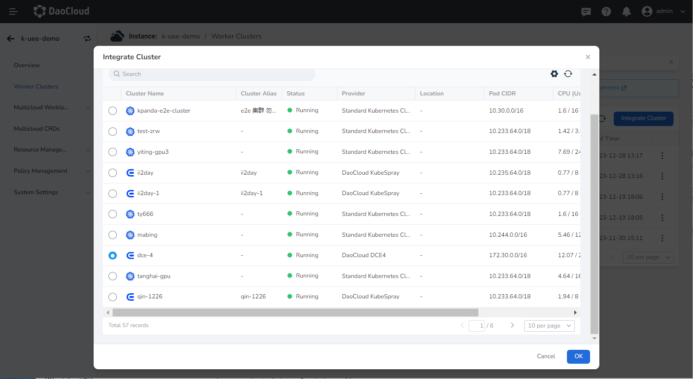
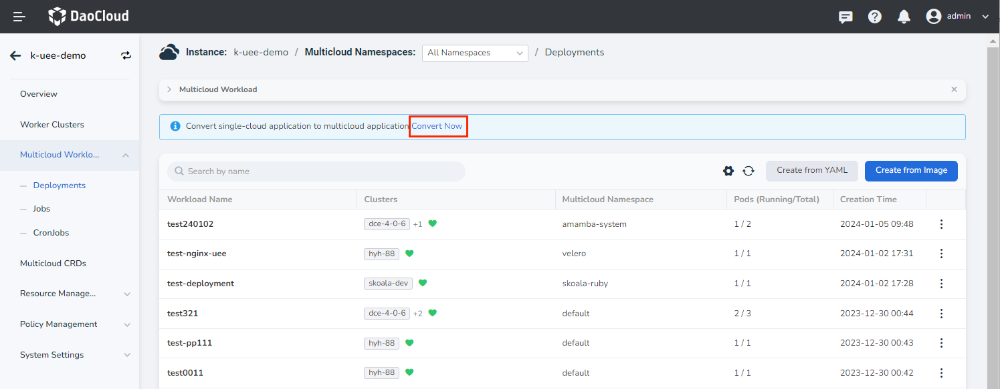
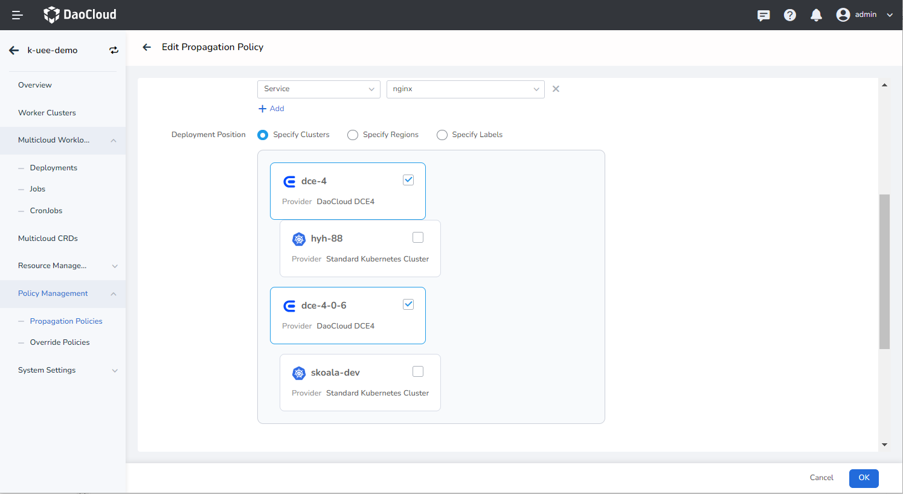

# Implement One-Click Migration from DCE 4.0 to DCE 5.0

This section provides a walkthrough on how to achieve one-click migrating applications from DCE 4.0 to DCE 5.0 using the deployment nginx as an example, facilitated through the Multicloud Management interface.

## Prerequisites

- Connect your container management module to a cluster managed by DCE. For instructions on how to do this, please refer to the [Manage Worker Clusters](../cluster.md) guide. After the connection is established, ensure that you can access the UI interface of the cluster.

- Confirm that the workload in your DCE 4.0 cluster is functioning normally. This tutorial assumes that your DCE 4.0 cluster is in good working condition.

## One-Click Migration

1. Navigate to the multicloud instance and select __Worker Clusters__. Click on __Integrate Cluster__ and choose to connect the DCE4 cluster to the multicloud instance.

    

2. Proceed to __Multicloud Workloads__ -> __Deployment__. Click on __Convert Now__ and select the target application. The related service will be selected automatically, and the corresponding configmaps and secrets will also undergo synchronous conversion.

    

    

3. Click __Update__ after a successful conversion, select the target deployment cluster, and enable automatic propagation. This will automatically detect and propagate resources such as ConfigMap and Secret used in the multicloud workload configuration.

    

4. Update the service's propagation policies and select the relevant clusters.

    

5. Confirm the successful operation of multicloud nginx: Ensure that Pods in both clusters are running successfully and are accessible.

    

6. The nginx workload in the DCE4 cluster will remain unaffected, ensuring the continuous service of the application.

    
