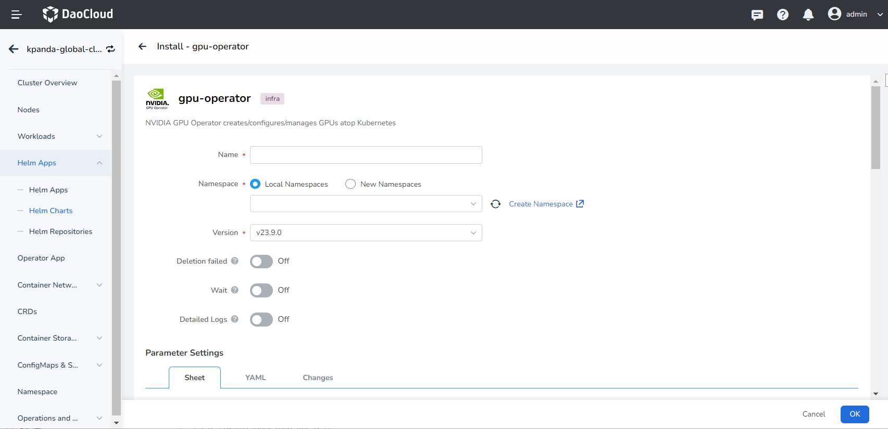
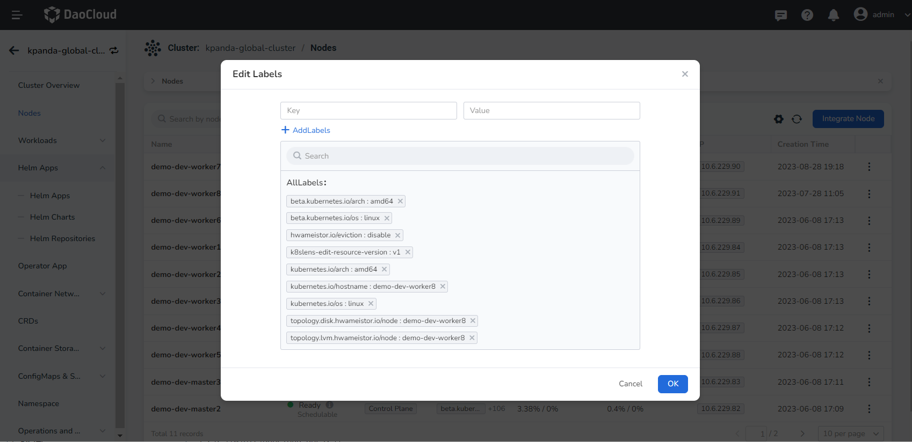
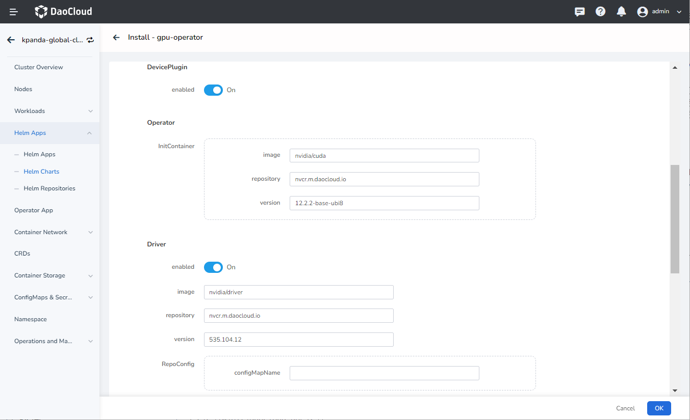

# Enabling MIG Function

This section describes how to enable NVIDIA MIG function. NVIDIA currently provides two strategies for exposing MIG devices on Kubernetes nodes:
> Tips: After the MIG mode is disabled, you need to restart the physical node in order to use the whole card mode normally.

- **Single mode**: Nodes expose a single type of MIG device on all their GPUs.
- **Mixed mode**: Nodes expose a mixture of MIG device types on all their GPUs.

For more details, refer to the [NVIDIA GPU Card Usage Modes](../index.md).

## Prerequisites

- Check the system requirements for the GPU driver installation on the target node: [GPU Support Matrix](../../gpu_matrix.md)
- Ensure that the cluster nodes have GPUs of the corresponding models ([NVIDIA H100](https://www.nvidia.com/en-us/data-center/h100/), [A100](https://www.nvidia.com/en-us/data-center/a100/), and [A30](https://www.nvidia.com/en-us/data-center/products/a30-gpu/) Tensor Core GPUs). For more information, see the [GPU Support Matrix](gpu_matrix.md).
- All GPUs on the nodes must belong to the same product line (e.g., A100-SXM-40GB).

## Enabling GPU MIG Single Mode

1. [Enable MIG Single mode](../install_nvidia_driver_of_operator.md) through the Operator. Configure the following parameters during the installation:

   - Set __DevicePlugin__ to __enable__ .
   - Set __MIG strategy__ to __single__ .
   - Enable the __Mig Manager__ with the __enabled__ parameter.
   - __MigManager Config__ : Configure MIG partitioning parameters and default values.

     - __default__ : The default value is __all-disabled__ , which can be replaced with the corresponding specification from the configuration file ( __default-mig-parted-config__ ), such as __all-1g.10gb__ :
         - **all-disabled**: MIG is disabled on all nodes by default.
         - **Configuration specification (e.g., all-1g.10gb)**: All nodes use the specified specification for MIG partitioning by default.
     - __name__ : MIG partitioning strategy configuration. The default value is __default-mig-parted-config__ .

        

2. If you need to specify a certain partitioning rule, add a label to the corresponding node (the node with the inserted GPU card). If this step is not performed, the default partitioning will be applied.

   **Configuration through the interface**: Find the corresponding node and select __Edit Labels__ . Add __nvidia.com/mig.config="all-1g.10gb"__ .

    

   **Command-line configuration**:

   ```sh
   kubectl label nodes {node} nvidia.com/mig.config="all-1g.10gb" --overwrite
   ```

3. Check the configuration:

   ```sh
   kubectl get node 10.206.0.17 -o yaml | grep nvidia.com/mig.config
   ```

## Enabling GPU MIG Mixed Mode

1. [Enable MIG Mixed mode](../install_nvidia_driver_of_operator.md) through the Operator. Configure the following parameters during the installation:

   - Set __DevicePlugin__ to __enable__ .
   - Set __MIG strategy__ to __mixed__ .
   - Enable the __Mig Manager__ with the __enabled__ parameter.
   - __MigManager Config__ : Configure MIG partitioning parameters and default values.

     - __default__ : The default value is __all-disabled__ , which can be replaced with the corresponding specification from the configuration file ( __default-mig-parted-config__ ), such as __all-1g.10gb__ .
     - __name__ : The default value is __default-mig-parted-config__ , which can be customized for the partitioning strategy configuration.

     The following YAML provides an example of a custom configuration named __custom-mig-parted-config__ . The created file must have a different name than the default ( __default-mig-parted-config__ ).

     Create a new configuration file named __custom-mig-parted-config__ and ensure that the key in the configuration data matches the content in the __config.yaml__ file.

        ```yaml title="config.yaml"
          ## Custom split GI instance configuration
          version: v1
          mig-configs:
            all-disabled:
              - devices: all
                mig-enabled: false

            # A100-40GB, A800-40GB
              all-1g.5gb:
                - devices: all
                  mig-enabled: true
                  mig-devices:
                    "1g.5gb": 7

            all-1g.5gb.me:
              - devices: all
                mig-enabled: true
                mig-devices:
                  "1g.5gb+me": 1

            all-2g.10gb:
              - devices: all
                mig-enabled: true
                mig-devices:
                  "2g.10gb": 3

            all-3g.20gb:
              - devices: all
                mig-enabled: true
                mig-devices:
                  "3g.20gb": 2

            all-4g.20gb:
              - devices: all
                mig-enabled: true
                mig-devices:
                  "4g.20gb": 1

            all-7g.40gb:
              - devices: all
                mig-enabled: true
                mig-devices:
                  "7g.40gb": 1

            # H100-80GB, H800-80GB, A100-80GB, A800-80GB, A100-40GB, A800-40GB
            all-1g.10gb:
              # H100-80GB, H800-80GB, A100-80GB, A800-80GB
              - device-filter: ["0x233010DE", "0x233110DE", "0x232210DE", "0x20B210DE", "0x20B510DE", "0x20F310DE", "0x20F510DE"]
                devices: all
                mig-enabled: true
                mig-devices:
                  "1g.10gb": 7

              # A100-40GB, A800-40GB
              - device-filter: ["0x20B010DE", "0x20B110DE", "0x20F110DE", "0x20F610DE"]
                devices: all
                mig-enabled: true
                mig-devices:
                  "1g.10gb": 4

            # H100-80GB, H800-80GB, A100-80GB, A800-80GB
            all-1g.10gb.me:
              - devices: all
                mig-enabled: true
                mig-devices:
                  "1g.10gb+me": 1

            # H100-80GB, H800-80GB, A100-80GB, A800-80GB
            all-1g.20gb:
              - devices: all
                mig-enabled: true
                mig-devices:
                  "1g.20gb": 4

            all-2g.20gb:
              - devices: all
                mig-enabled: true
                mig-devices:
                  "2g.20gb": 3

            all-3g.40gb:
              - devices: all
                mig-enabled: true
                mig-devices:
                  "3g.40gb": 2

            all-4g.40gb:
              - devices: all
                mig-enabled: true
                mig-devices:
                  "4g.40gb": 1

            all-7g.80gb:
              - devices: all
                mig-enabled: true
                mig-devices:
                  "7g.80gb": 1

            # A30-24GB
            all-1g.6gb:
              - devices: all
                mig-enabled: true
                mig-devices:
                  "1g.6gb": 4

            all-1g.6gb.me:
              - devices: all
                mig-enabled: true
                mig-devices:
                  "1g.6gb+me": 1

            all-2g.12gb:
              - devices: all
                mig-enabled: true
                mig-devices:
                  "2g.12gb": 2

            all-2g.12gb.me:
              - devices: all
                mig-enabled: true
                mig-devices:
                  "2g.12gb+me": 1

            all-4g.24gb:
              - devices: all
                mig-enabled: true
                mig-devices:
                  "4g.24gb": 1

            # H100 NVL, H800 NVL
            all-1g.12gb:
              - devices: all
                mig-enabled: true
                mig-devices:
                  "1g.12gb": 7

            all-1g.12gb.me:
              - devices: all
                mig-enabled: true
                mig-devices:
                  "1g.12gb+me": 1

            all-2g.24gb:
              - devices: all
                mig-enabled: true
                mig-devices:
                  "2g.24gb": 3

            all-3g.47gb:
              - devices: all
                mig-enabled: true
                mig-devices:
                  "3g.47gb": 2

            all-4g.47gb:
              - devices: all
                mig-enabled: true
                mig-devices:
                  "4g.47gb": 1

            all-7g.94gb:
              - devices: all
                mig-enabled: true
                mig-devices:
                  "7g.94gb": 1

            # H100-96GB, PG506-96GB
            all-3g.48gb:
              - devices: all
                mig-enabled: true
                mig-devices:
                  "3g.48gb": 2

            all-4g.48gb:
              - devices: all
                mig-enabled: true
                mig-devices:
                  "4g.48gb": 1

            all-7g.96gb:
              - devices: all
                mig-enabled: true
                mig-devices:
                  "7g.96gb": 1

            # H100-96GB, H100 NVL, H800 NVL, H100-80GB, H800-80GB, A800-40GB, A800-80GB, A100-40GB, A100-80GB, A30-24GB, PG506-96GB
            all-balanced:
              # H100 NVL, H800 NVL
              - device-filter: ["0x232110DE", "0x233A10DE"]
                devices: all
                mig-enabled: true
                mig-devices:
                  "1g.12gb": 1
                  "2g.24gb": 1
                  "3g.47gb": 1

              # H100-80GB, H800-80GB, A100-80GB, A800-80GB
              - device-filter: ["0x233010DE", "0x233110DE", "0x232210DE", "0x20B210DE", "0x20B510DE", "0x20F310DE", "0x20F510DE"]
                devices: all
                mig-enabled: true
                mig-devices:
                  "1g.10gb": 2
                  "2g.20gb": 1
                  "3g.40gb": 1

              # A100-40GB, A800-40GB
              - device-filter: ["0x20B010DE", "0x20B110DE", "0x20F110DE", "0x20F610DE"]
                devices: all
                mig-enabled: true
                mig-devices:
                  "1g.5gb": 2
                  "2g.10gb": 1
                  "3g.20gb": 1

              # A30-24GB
              - device-filter: "0x20B710DE"
                devices: all
                mig-enabled: true
                mig-devices:
                  "1g.6gb": 2
                  "2g.12gb": 1

              # H100-96GB, PG506-96GB
              - device-filter: ["0x233D10DE", "0x20B610DE"]
                devices: all
                mig-enabled: true
                mig-devices:
                  "1g.12gb": 2
                  "2g.24gb": 1
                  "3g.48gb": 1

           # After setting, the CI instance will be partitioned according to the set specifications 
            custom-config:    
              - devices: all
                mig-enabled: true
                mig-devices:
                  "1g.10gb": 4
                  "1g.20gb": 2

        ```

        Set __custom-config__ in the above __YAML__, and after setting, the __CI__ instance will be partitioned according to the specification.

        ```yaml
        custom-config:
             devices: all
            mig-enabled: true
            mig-devices:
              1c.3g.40gb: 6
        ```

        

2. If you need to split the instance according to custom rules, you can add the partitioning specification to the corresponding node. If this step is not performed, the default values will be used for partitioning.

   **Configuration through the interface**: Find the corresponding node and select __Edit Labels__ . Add __nvidia.com/mig.config="custom-config"__ .

    

   **Command-line configuration**:

   ```sh
   kubectl label nodes {node} nvidia.com/mig.config="custom-config" --overwrite
   ```

3. Check the configuration:

   ```sh
   kubectl get node 10.206.0.17 -o yaml | grep nvidia.com/mig.config
   ```

Once you have completed these steps, you can [use MIG GPU resources](mig_usage.md) when deploying your applications.
