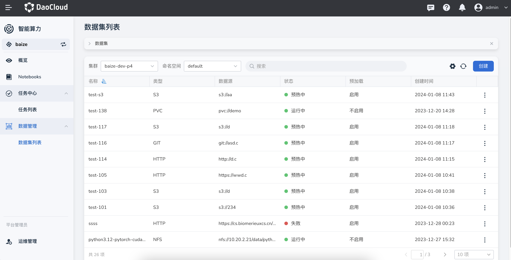
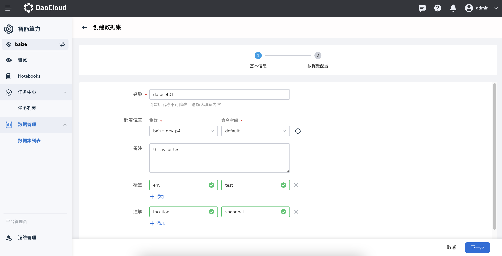

# 创建数据集

数据集是将各类数据源统一封装成可通过 Kubernetes 高效访问的文件或对象集合，以支持在开发训练训练时快速使用数据。

1. 在左侧导航栏中点击 **数据管理** -> **数据集列表** ，点击右侧的 **创建** 按钮。

    

1. 系统会预先填充要部署的集群、命名空间，添加名称、标签、注解等基本信息后点击 **下一步** 。

    

1. 选择一种数据源类型后，点击 **确定** 。

    

    目前支持这几种数据源：

    - GIT：支持 GitHub、GitLab、Gitee 等仓库
    - S3：支持 Amazon 云等对象存储
    - HTTP：直接输入一个有效的 HTTP 网址
    - PVC：支持预先创建的 Kubernetes PersistentVolumeClaim
    - NFS：支持 NFS 共享存储

1. 数据集创建成功将返回数据集列表。

!!! info

    系统自动会在数据集创建成功后，立即进行一次性的数据预加载；在预加载完成之前，数据集不可以使用。

## 示例

**训练用代码**

```yaml
apiVersion: "kubeflow.org/v1"
kind: PyTorchJob
metadata:
  name: pytorch-distributed-sample-v1 # update job name
  namespace: luchuanjia-p4 # update namespace
  annotations:
    baize.io/description: ""
  labels:
    jobs.baize.io/training-mode: DISTRIBUTED
    kueue.x-k8s.io/queue-name: p4-gpu # update queue name
spec:
  pytorchReplicaSpecs:
    Master:
      replicas: 1
      restartPolicy: OnFailure
      template:
        spec:
          containers:
            - name: pytorch
              image: dockerproxy.com/kubeflowkatib/pytorch-mnist:v1beta1-45c5727
              imagePullPolicy: Always
              command:
                - "python3"
                - "/opt/pytorch-mnist/mnist.py"
                - "--epochs=1"
              resources:
                limits:
                  cpu: "1"
                  memory: 2Gi
                  nvidia.com/gpu: '1' # use gpu
                requests:
                  cpu: "1"
                  memory: 2Gi
                  nvidia.com/gpu: '1'
          priorityClassName: baize-medium-priority
    Worker:
      replicas: 1
      restartPolicy: OnFailure
      template:
        spec:
          containers:
            - name: pytorch
              image: dockerproxy.com/kubeflowkatib/pytorch-mnist:v1beta1-45c5727
              imagePullPolicy: Always
              command:
                - "python3"
                - "/opt/pytorch-mnist/mnist.py"
                - "--epochs=1"
              resources:
                limits:
                  cpu: "1"
                  memory: 2Gi
                  nvidia.com/gpu: '1'
                requests:
                  cpu: "1"
                  memory: 2Gi
                  nvidia.com/gpu: '1'
          priorityClassName: baize-medium-priority
```

**训练用数据** ： <https://github.com/zalandoresearch/fashion-mnist>
