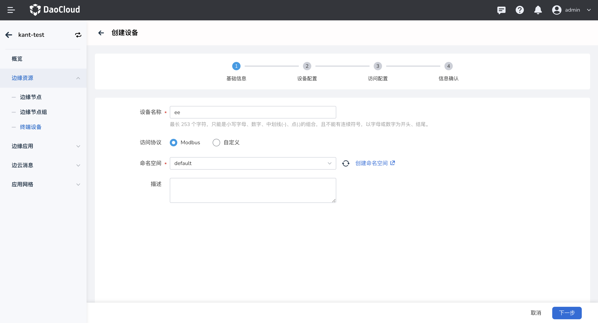
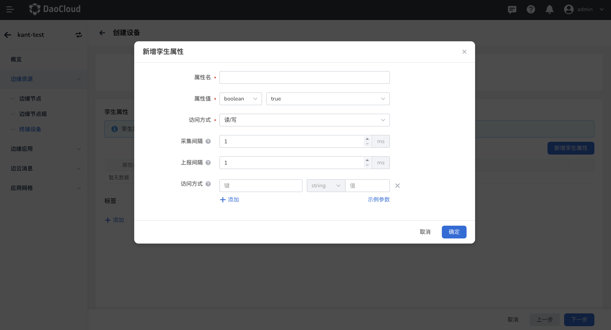

# 创建终端设备

终端设备可以连接到边缘节点，支持通过 Modbus 协议或自定义协议接入。终端设备接入后，可以在云端管理平面对设备进行统一管理。

本文介绍创建终端设备和终端设备绑定边缘节点的操作步骤。

## 创建终端设备

操作步骤如下：

1. 进入边缘单元详情页，选择左侧菜单`边缘资源` -> `终端设备`。

2. 点击终端设备列表右上角`创建设备`按钮。

    

3. 填写基础信息。

    - 设备名称：小写字母、数字、中划线（-）、点（.）的组合，不能有连续符号；以字母或数字为开头、结尾；最多包含 253 个字符。
    - 访问协议：当前平台支持 Modbus 协议设备接入，如果您的设备非 Modbus 协议，您可以选择 `自定义`，并输入协议名称。
    - 命名空间：设备所在命名空间，命名空间的资源相互隔离。
    - 描述：设备描述信息。

    

4. 填写设备配置，可以添加设备孪生属性和标签。

    **Modbus 协议**

    - 孪生属性：选填，指终端设备的动态数据，包括专有实时数据，例如灯的开、关状态，温湿度传感器的温度、适度等。
    - 标签：选填，通过给设备打上标签，将不同设备进行分类管理。

    

    新增孪生属性，用户可以根据设备类型选择对应的寄存器类型，并填写对应的参数。参数说明如下：

    - 寄存器类型：Modbus 协议设备的寄存器类型包含：线圈寄存器、离散输入寄存器、保持寄存器、输入寄存器。
    - 属性名：必填项，设备属性名称。
    - 属性值：必填项，属性的期望值，根据寄存器类型属性值的类型不同。
    - 访问方式：默认值，根据寄存器类型默认的访问方式不同。
    - 寄存器地址：必填，属性对应的起始数据位。
    - 采集间隔：选填，对设备进行指定间隔的数据采集及上报。
    - 交换高低字节：对获取的每个寄存器中的两个字节内容进行交换。
    - 交换寄存器顺序：对获取的所有寄存器按从高到低顺序反转交换。
    - 属性值区间：对获取的原始数据进行范围限定。
    - 缩放因子：对获取的原始数据进行缩放处理。

    

    **自定义协议**

    - 属性名、属性值、访问方式、采集间隔填写同 Modbus 协议。
    - 上报间隔：对设备进行指定间隔的数据上报，单位为 ms。
    - 访问方式：平台连接到设备后，访问设备属性的方式。

    

5. 填写设备访问配置。

    **Modbus 协议**

    Modbus 协议有 RTU 和 TCP 两种传输模式。不同模式下的访问配置有所不同。

    - Slave Id：访问寄存器值时的标识字段。

    **RTU 传输模式：**

    - 串口：终端设备连接的串口，不同边缘节点操作系统下可选择不同的值。
    - 波特率：每秒钟传送码元符号的个数，衡量数据传输速率的指标。
    - 数据位：衡量通信中实际数据位的参数。
    - 校验位：一种简单的校错方式，判断是否有噪声干扰通信或者是否存在传输和接收数据不同步。
    - 停止位：用于表示单个数据包的最后一位。

    

    **TCP 传输模式：**

    - IP地址：终端设备的IP地址。
    - 端口：终端设备的端口。

    

    **自定义协议**

    访问配置参数由用户自定义配置。配置参数值平台连接到设备的访问参数。

6. 信息确认，确认所配置的信息无误，点击`确定`，完成设备创建。

    

## 终端设备绑定边缘节点

一个终端设备只能绑定一个边缘节点，设备绑定节点后，部署在节点上的应用可以通过云端创建的设备孪生获取到设备实时数据。

操作步骤如下：

1. 进入边缘单元详情页，选择左侧菜单`边缘资源` -> `终端设备`。

2. 在终端设备列表的右侧，点击 `⋮` 按钮，在弹出菜单中选择`绑定节点`。

3. 在弹框中选择要绑定的节点，点击`确定`，完成边缘节点的绑定。

    

下一步：[管理终端设备](manage-device.md)
