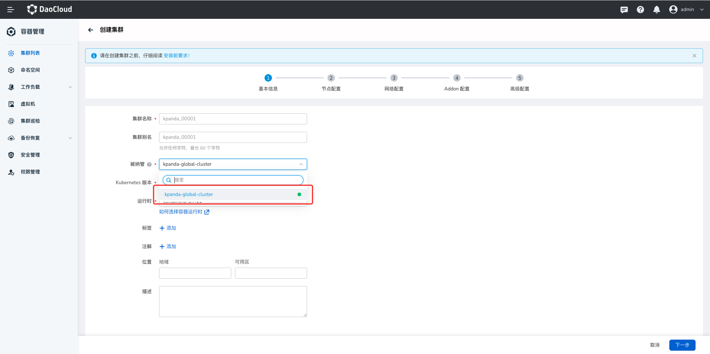
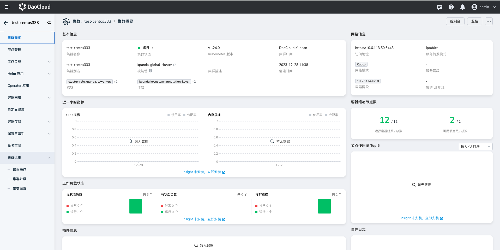
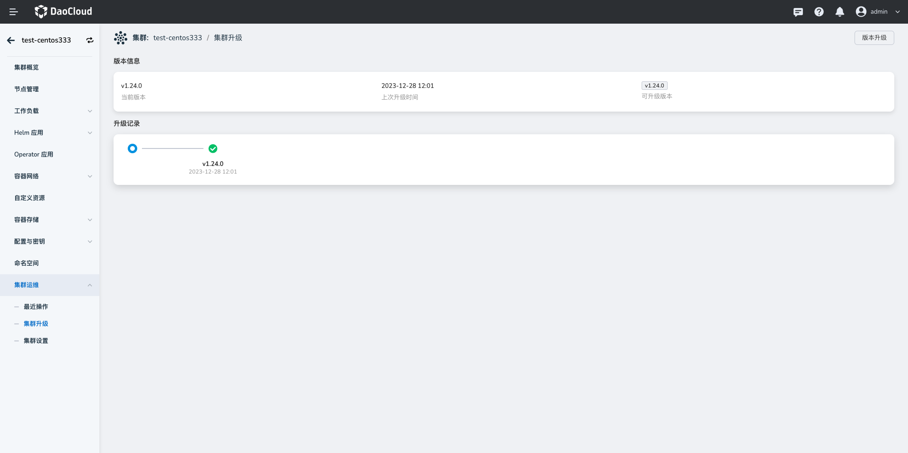
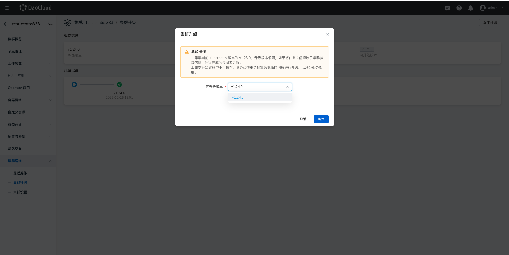

# 离线场景 Kubean 向下兼容版本的部署与升级操作

为了满足客户对低版本的 K8s 集群的搭建，Kubean 提供了向下兼容并创建低版本的 K8s 集群能力。

目前支持自建工作集群版本范围在 `1.26.0-v1.28`，可以参阅 [DCE 5.0 集群版本支持体系](./cluster-version.md)。

本文将演示如何部署低版本的 K8s 集群。

!!! note

    本文演示的节点环境为：

    - X86 架构
    - CentOS 7 Linux 发行版

## 前提条件

- 准备一个 kubean 所在的管理集群，并且当前环境已经部署支持 `podman` 、`skopeo`、`minio client`命令。
  如果不支持，可通过脚本进行安装依赖组件，[安装前置依赖](../install-tools.md)。

- 前往 [kubean](https://github.com/kubean-io/kubean) 查看发布的[制品](https://kubean-io.github.io/kubean/zh/releases/artifacts/)，并根据实际情况选择具体的制品版本。目前支持的制品版本及对应的集群版本范围如下：

    | 制品包版本   | 支持集群范围 | DCE 5.0 支持情况 |
    | ----------- | ----------- | ------ |
    | release-2.21   | v1.23.0 ~ v1.25.6      | 安装器 v0.14.0+ 已支持 |
    | release-2.22   |    v1.24.0 ~ v1.26.9    | 预计安装器 v0.15.0+ |
    | release-2.23   |    v1.25.0 ~ v1.27.7    | 预计安装器 v0.16.0+ |

    本文演示离线部署 K8s 集群到 1.23.0 版本及离线升级 K8s 集群从 1.23.0 版本到 1.24.0 版本，所以选择 `release-2.21` 的制品。

## 操作步骤

### 准备 Kubespray Release 低版本的相关制品

将 spray-job 镜像导入到离线环境的 registry 当中。

```bash
# 假设火种集群中的 registry 地址为 172.30.41.200
REGISTRY_ADDR="172.30.41.200"

# 镜像 spray-job 这里可以采用加速器地址，镜像地址根据选择制品版本来决定
SPRAY_IMG_ADDR="ghcr.m.daocloud.io/kubean-io/spray-job:2.21-d6f688f"

# skopeo 参数
SKOPEO_PARAMS=" --insecure-policy -a --dest-tls-verify=false --retry-times=3 "

# 在线环境：导出 release-2.21 版本的 spray-job 镜像，并将其转移到离线环境
skopeo copy docker://${SPRAY_IMG_ADDR} docker-archive:spray-job-2.21.tar

# 离线环境：导入 release-2.21 版本的 spray-job 镜像到火种 registry
skopeo copy ${SKOPEO_PARAMS} docker-archive:spray-job-2.21.tar docker://${REGISTRY_ADDR}/${SPRAY_IMG_ADDR}
```

### 制作低版本 K8s 离线资源

1. 准备 manifest.yml 文件。

    ```bash
    cat > "manifest.yml" <<EOF
    image_arch:
      - "amd64" ## "arm64"
    kube_version: ## 根据实际场景填写集群版本
      - "v1.23.0"
      - "v1.24.0"
    EOF
    ```

2. 制作离线增量包。

    ```bash
    # 创建 data 目录
    mkdir data
    # 制作离线包，
    AIRGAP_IMG_ADDR="ghcr.m.daocloud.io/kubean-io/airgap-patch:2.21-d6f688f" # (1)
    podman run --rm -v $(pwd)/manifest.yml:/manifest.yml -v $(pwd)/data:/data  -e ZONE=CN -e MODE=FULL ${AIRGAP_IMG_ADDR}
    ```

    1. 镜像 spray-job 这里可以采用加速器地址，镜像地址根据选择制品版本来决定

3. 导入对应 k8s 版本的离线镜像与二进制包

    ```bash
    # 将上一步 data 目录中的二进制导入二进制包至火种节点的 minio 中
    cd ./data/amd64/files/
    MINIO_ADDR="http://172.30.41.200:9000" # IP 替换为实际的仓库地址
    MINIO_USER=rootuser MINIO_PASS=rootpass123 ./import_files.sh ${MINIO_ADDR}
    
    # 将上一步 data 目录中的镜像导入二进制包至火种节点的镜像仓库中
    cd ./data/amd64/images/
    REGISTRY_ADDR="172.30.41.200"  ./import_images.sh # IP 替换为实际的仓库地址
    ```

4. 将 `manifest`、`localartifactset.cr.yaml` 自定义资源部署到 **kubean 所在的管理集群或者 Global 集群** 当中，本例使用的是 Global 集群。

    ```bash
    # 部署 data 文件目录下的 localArtifactSet 资源
    cd ./data
    kubectl apply -f data/localartifactset.cr.yaml

    # 下载 release-2.21 版本的 manifest 资源
    wget https://raw.githubusercontent.com/kubean-io/kubean-manifest/main/manifests/manifest-2.21-d6f688f.yml

    # 部署 release-2.21 对应的 manifest 资源。。
    kubectl apply -f manifest-2.21-d6f688f.yml
    ```

### 低版本 K8s 集群的部署与升级

#### 部署

1. 前往 `容器管理`，在 __集群列表__ 页面中，点击 __创建集群__ 按钮。

2. `被纳管`参数选择 `manifest`、`localartifactset.cr.yaml` 自定义资源部署的集群，本例使用的是 Global 集群。

    

3. 其余参数参考[创建集群](../user-guide/clusters/create-cluster.md)

    

#### 升级

1. 选择新创建的集群，进去详情界面。

2. 然后在左侧导航栏点击 __集群运维__ -> __集群升级__ ，在页面右上角点击 __版本升级__ 。

    

3. 选择可用的集群进行升级。

    
