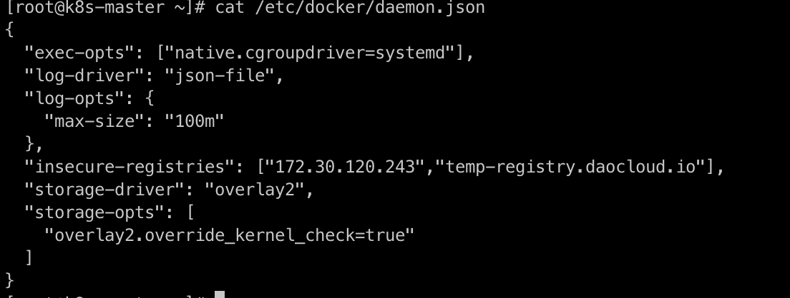

---
hide:
  - toc
---

# 常见问题

本页面列出了一些在容器管理中可能遇到的常见问题，为您提供便利的故障排除解决方案。

1. Helm 应用安装失败，提示 “OOMKilled”

    

    如图所示，容器管理会自动创建启动一个 Job 负责具体应用的安装工作，在 v0.6.0 版本中由于 job resources 设置不合理，导致 OOM,影响应用安装。该 bug 在 0.6.1 版本中已经被修复。如果是升级到 v0.6.1的环境，仅仅会在新创建、接入的集群中生效，已经存在的集群需要进行手动调整，方能生效。

    ??? note "调整脚本"

        - 以下脚本均在全局服务集群中执行
        - 找到对应集群，本文以 skoala-dev 为例,获取对应的 skoala-dev-setting configmap
        - 更新 configmap 之后即可生效

            ```shell
            kubectl get cm -n kpanda-system skoala-dev-setting -o yaml
            apiVersion: v1
            data:
            clusterSetting: '{"plugins":[{"name":1,"intelligent_detection":true},{"name":2,"enabled":true,"intelligent_detection":true},{"name":3},{"name":6,"intelligent_detection":true},{"name":7,"intelligent_detection":true},{"name":8,"intelligent_detection":true},{"name":9,"intelligent_detection":true}],"network":[{"name":4,"enabled":true,"intelligent_detection":true},{"name":5,"intelligent_detection":true},{"name":10},{"name":11}],"addon_setting":{"helm_operation_history_limit":100,"helm_repo_refresh_interval":600,"helm_operation_base_image":"release-ci.daocloud.io/kpanda/kpanda-shell:v0.0.6","helm_operation_job_template_resources":{"limits":{"cpu":"50m","memory":"120Mi"},"requests":{"cpu":"50m","memory":"120Mi"}}},"clusterlcm_setting":{"enable_deletion_protection":true},"etcd_backup_restore_setting":{"base_image":"release.daocloud.io/kpanda/etcdbrctl:v0.22.0"}}'
            kind: ConfigMap
                metadata:
                labels:
                    kpanda.io/cluster-plugins: ""
                name: skoala-dev-setting
                namespace: kpanda-system
                ownerReferences:
                - apiVersion: cluster.kpanda.io/v1alpha1
                    blockOwnerDeletion: true
                    controller: true
                    kind: Cluster
                    name: skoala-dev
                    uid: f916e461-8b6d-47e4-906e-5e807bfe63d4
                uid: 8a25dfa9-ef32-46b4-bc36-b37b775a9632

                修改 clusterSetting-> helm_operation_job_template_resources 到合适的值即可，v0.6.1 版本对应的值为 cpu: 100m,memory: 400Mi
                ```

2. 容器管理模块和全局管理模块的权限问题

    经常有用户会问，为什么我这个用户可以看到这个集群，或者为什么我看不到这个集群，我们应该如何排查相关的权限问题？分为以下三种情况：

    - 容器管理模块的权限分为集群权限、命名空间权限。如果绑定了用户，那该用户就可以查看到相对应的集群及资源。具体权限说明，可以参考[集群权限说明](../user-guide/permissions/permission-brief.md)。

        

    - 全局管理模块中用户的授权：使用 admin 账号，进入 __全局管理__ -> __用户与访问控制__ -> __用户__ 菜单，找到对应用户。在 __授权所属用户组__ 标签页，如果有类似 Admin、Kpanda Owner 等拥有容器管理权限的角色，那即使在容器管理没有绑定集群权限或命名空间权限，也可以看到全部的集群，可以参考[用户授权文档说明](../../ghippo/user-guide/access-control/user.md)

        

    - 全局管理模块中工作空间的绑定：使用账号进入 __全局管理__ -> __工作空间与层级__ ，可以看到自己的被授权的工作空间，点击工作空间名称

        a.如果该工作空间单独授权给自己，就可以在授权标签页内看到自己的账号，然后查看资源组或共享资源标签页，如果资源组绑定了命名空间或共享资源绑定了集群，那该账号就可以看到对应的集群

        b.如果是被授予了全局管理相关角色，那就无法授权标签页内看到自己的账号，也无法在容器管理模块中看到工作空间所绑定的集群资源

        

3. Helm 安装应用时，无法拉取 kpanda-shell 镜像

    使用离线安装后，接入的集群安装helm应用经常会遇到拉取 kpanda-shell 镜像失败，如图：

    

    此时，只需要去集群运维-集群设置页面，高级配置标签页，修改 Helm 操作基础镜像为一个可以被该集群正常拉取到的 kpanda-shell 的镜像即可。

    

4. Helm Chart 界面未显示最新上传到对应 Helm Repo 的 Chart，如图：

    

    此时，只需要去 Helm 仓库刷新对应的 Helm 仓库即可。

    

5. Helm 安装应用失败时卡在安装中无法删除应用重新安装，如图：

    

    此时，只需要去自定义资源页面，找到 helmreleases.helm.kpanda.io CRD，然后找到对应的 helmreleases CR 删除即可。

    

    

6. 工作负载-删除节点亲和性等调度策略后，调度异常，如图：

    

    此时，可能是因为策略没有删除干净，点击编辑，删除所有策略。

    

    

    

7. Kcoral 检测工作集群 Velero 状态的逻辑是什么？

    

    - 工作集群在velero命名空间下安装了标准的velero组件
  
    - velero 控制面 velero deployment 处于运行状态，并达到期望的副本数

    - velero 数据面 node agent 处于运行状态，并达到期望副本数

    - velero 成功连接到目标 MinIO（BSL 状态为 Available）

8. 在跨集群备份还原的时候，Kcoral 如何获取可用集群？

    在通过Kcoral跨集群备份还原应用的时候，在恢复页面中，Kcoral 会帮助用户筛选可以执行跨集群还原的集群列表，逻辑如下：

    

    - 过滤未安装 Velero 的集群列表
  
    - 过滤 Velero 状态异常的集群列表

    - 获取与目标集群对接了相同 MinIO 和 Bucket 的集群列表并返回

    所以只要对接了相同的 MinIO 和 Bucket，Velero 处于运行状态，就可以跨集群备份（需要有写入权限）和还原。

9. 卸载 VPA，HPA，CronHPA 之后，为什么对应弹性伸缩记录依然存在？

    虽然通过 Helm Addon 市场中把对应组件卸载，但是应用弹性伸缩界面相关记依然在，如下图所示:

    

    这是 helm uninstall 的一个问题，它并不会卸载对应的 CRD，因此导致数据残留，此时我们需要手动卸载对应的 CRD , 完成最终清理工作。

10. 为什么低版本集群的控制台打开异常？

    在 kubernetes 低版本（v1.18以下）的集群中，打开控制台出现 csr 资源请求失败。打开控制台的时候，会根据当前登录用户在目标集群中通过 csr 资源申请证书，如果集群版本太低或者没有开启此功能 controller，会导致证书申请失败，从而无法连接到目标集群。

    申请证书流程请参考：https://kubernetes.io/docs/reference/access-authn-authz/certificate-signing-requests/
    
    解决方案：

    - 如果集群版本大于 v1.18，请检查 kube-controller-manager 是否开启 csr 功能，确保以下的 controller 是否正常开启

        ```shell
        ttl-after-finished,bootstrapsigner,csrapproving,csrcleaner,csrsigning
        ```

    - 低版本集群目前解决方案只有升级版本

11. 如何重置创建的集群？

    创建的集群分为两种情况：

    - 创建失败的集群：在创建集群的过程中，因为参数设置错误导致集群创建失败，这种情况可以在安装失败的集群选择重试，然后重新设置参数重新创建。

    - 已经成功创建的集群：这种集群可以先卸载集群，然后重新创建集群。卸载集群需要关闭集群保护的功能才能卸载集群。

        

        

12. 接入集群安装插件失败

    离线环境接入的集群，在安装插件之前，需要先配置 CRI 代理仓库，以忽略 TLS 验证(所有节点都需要执行)。

    **docker**

        1. 修改文件 /etc/docker/daemon.json

        2. 加入： "insecure-registries": ["172.30.120.243","temp-registry.daocloud.io"],

            修改之后内容如下:
        
            

        3. 重启 docker 

            ```shell
            systemctl restart docker
            systemctl daemon-reload
            ```

    **containerd**

        1. 修改 /etc/containerd/config.toml

        2. 修改之后内容如下:

            ```shell
            [plugins."io.containerd.grpc.v1.cri".registry.mirrors."docker.io"]
            endpoint = ["https://registry-1.docker.io"]
            [plugins."io.containerd.grpc.v1.cri".registry.mirrors."temp-registry.daocloud.io"]
            endpoint = ["http://temp-registry.daocloud.io"]
            [plugins."io.containerd.grpc.v1.cri".registry.configs."http://temp-registry.daocloud.io".tls]
            insecure_skip_verify = true
            ```
            
            

        3. 注意空格和换行符，确保配置正确，修改完成之后执行

            ```shell
            systemctl restart containerd
            ```