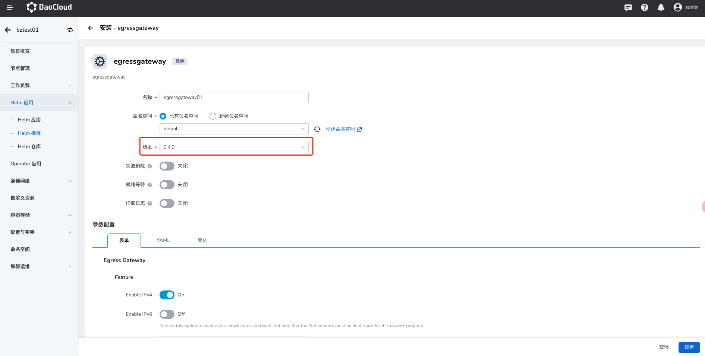

# 安装 EgressGateway

本章节主要介绍如何安装 EgressGateway 组件。

## 前提条件

- 在 DCE 5.0 集群内使用 EgressGateway，需要结合 [Calico/Flannel/Weave/Spiderpool](../../modules/egressgateway/usage.md)。

- 建议安装 v0.4.0 及其以上的 EgressGateway 版本，安装后可以创建出口网关实例并配合出口网关策略使用。

## 安装步骤

请确认您的集群已成功接入`容器管理`平台，然后执行以下步骤安装 EgressGateway。

1. 在左侧导航栏点击 `容器管理` —> `集群列表`，然后找到准备安装 EgressGateway 的集群名称。

1. 在左侧导航栏中选择 `Helm 应用` -> `Helm 模板`，找到并点击 `egressgateway`。

    

1. 在版本选择中选择希望安装的版本，点击安装，在安装界面，填写所需的安装参数。

    

    

    上图中的各项参数说明：

    - `命名空间`：部署 EgressGateway 组件的命名空间，默认为 `default`。可更改其他命名空间。

    - `Feature` —> `Enable IPv4`：支持开启 IPv4，并默认开启。
    - `Feature` —> `Enable IPv6`：支持开启 IPv6，默认关闭。若启用，Pod 网络必须是双栈才能正常使用。

    - `Feature` -> `Tunnel IPv4 subnet`：设置隧道的 IPv4 子网，可使用默认值。若更改，不得与集群中的 CIDR 重复，造成网络冲突。
    - `Feature` -> `Tunnel IPv6 subnet`：设置隧道的 IPv6 子网，可使用默认值。若更改，不得与集群中的 CIDR 重复，造成网络冲突。

    - `Feature` -> `VXLAN Setting` -> `VXLAN name`：设置 VXLAN 名称，可使用默认值。
    - `Feature` -> `VXLAN Setting` -> `VXLAN port`：设置 VXLAN 端口，可使用默认值。
    - `Feature` -> `VXLAN Setting` -> `VXLAN ID`：设置 VXLAN ID，可使用默认值。

    - `Feature` -> `Iptables Setting` -> `Backend mode`：设置 iptable 的模式，默认选择 auto 模式。若更改，您可以通过在集群主机上运行 “iptables –version” 来查看 iptables 的当前模式。

    

    上图中的各项参数说明：

    - `Controller Setting` —> `Image Setting`-> `Image registry`：设置镜像名，可使用默认值。
    - `Controller Setting` —> `Debug Setting`-> `Log level`：设置日志级别，可使用默认值，或者下拉选择其他级别。
    - `Controller Setting` —>`Prometheus Setting` —> `ServiceMonitor Setting`-> `Log level`-> `Install`：支持开启安装 Prometheus 监控，默认不安装。

    - `Agent Setting` —> `Image Setting`-> `Image registry`：设置镜像名，可使用默认值。
    - `Controller Setting` —> `Debug Setting`-> `Log level`：设置日志级别，可使用默认值，或者下拉选择其他级别。
    - `Controller Setting` —>`Prometheus Setting` —> `ServiceMonitor Setting`-> `Log level`-> `Install`：支持开启安装 Prometheus 监控，默认不安装。

1. 参数设置完成后点击` 确定`完成安装，完成后可参考创建出口网关实例和网关策略进行出口网关的使用。