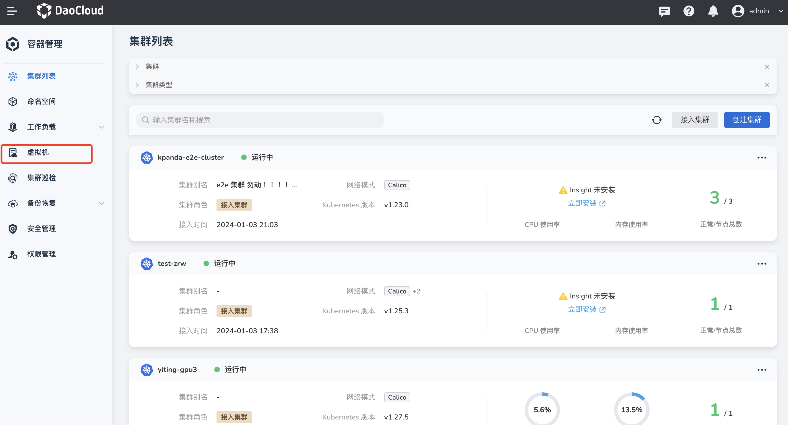
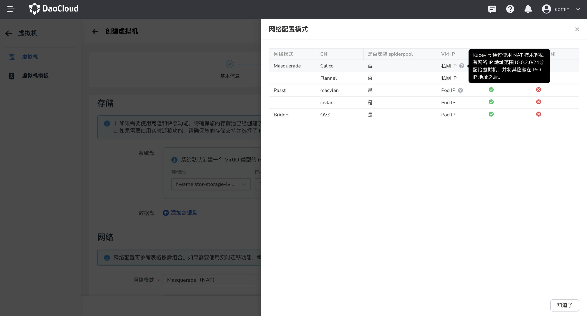
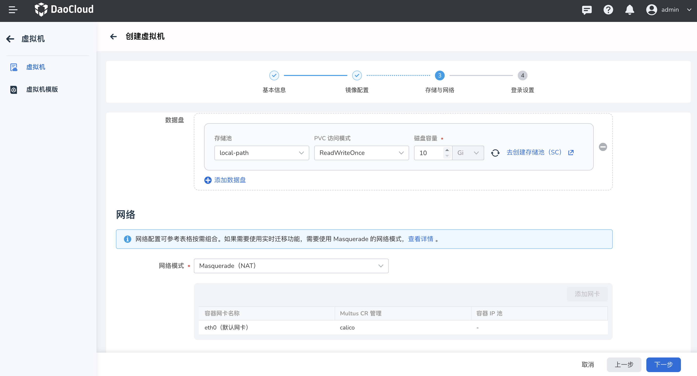
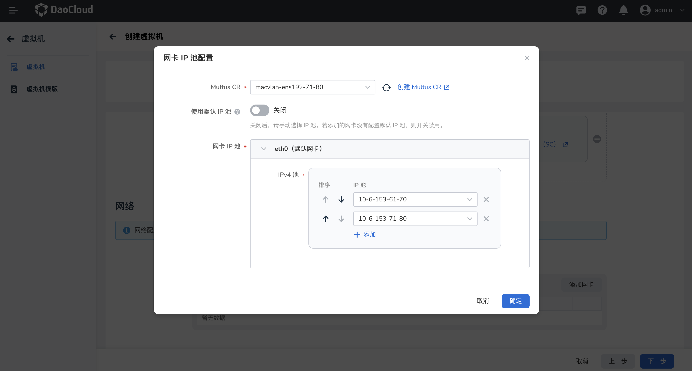

# 创建虚拟机

本文将介绍如何通过镜像和 YAML 文件两种方式创建虚拟机。

虚拟机基于 KubeVirt 技术将虚拟机作为云原生应用进行管理，与容器无缝地衔接在一起，
使用户能够轻松地部署虚拟机应用，享受与容器应用一致的丝滑体验。

## 前提条件

创建虚拟机之前，需要满足以下前提条件：

- 向用户机操作系统公开硬件辅助的虚拟化。
- 在指定集群[安装 virtnest-agent](../install/index.md)，操作系统内核版本需要在 3.15 以上。
- 创建一个[命名空间](../../kpanda/user-guide/namespaces/createns.md)和[用户](../../ghippo/user-guide/access-control/user.md)。
- 提前准备好镜像，平台内置三种镜像 (如下文所示)，如需制作镜像，可参考开源项目[制作镜像](https://github.com/Tedezed/kubevirt-images-generator/tree/master)。
- 进行网络配置时，若选择使用 Passt 网络模式，则需要升级至 0.4.0 及以上版本。

## 镜像创建

参考以下步骤，使用镜像创建一个虚拟机。

1. 点击左侧导航栏上的`容器管理`，然后点击`虚拟机`，进入`虚拟机`页面。

    

2. 在虚拟机列表页面，点击`创建虚拟机` -> 选择`通过镜像创建`。

    

3. 进入镜像创建页面，依次填写基本信息、镜像配置、存储与网络、登录设置后，在页面右下角点击`确定`完成创建。

    系统将自动返回虚拟机列表。点击列表右侧的 `︙`，可以对虚拟机执行关机/开启、重启、克隆、更新、创建快照、控制台访问（VNC）、删除等操作。
    克隆和快照能力依赖于存储池的选择。

    

### 基本信息

在`创建虚拟机`页面中，根据下表输入信息后，点击`下一步`。


- 名称：最多包含 63 个字符，只能包含小写字母、数字及分隔符（“-”），且必须以小写字母或数字开头及结尾。
  同一命名空间内名称不得重复，而且名称在虚拟机创建好之后不可更改。
- 别名：允许任何字符，最长 60 个字符。
- 集群：选择将新建的虚拟机部署在哪个集群内。
- 命名空间：选择将新建的虚拟机部署在哪个命名空间。
  找不到所需的命名空间时可以根据页面提示去[创建新的命名空间](../../kpanda/user-guide/namespaces/createns.md)。
- 标签/注解：选择为虚拟机添加所需的标签/注解信息。

### 镜像配置

根据下表填写镜像相关信息后，点击`下一步`


- 镜像来源：支持三种类型的来源。

    - 镜像仓库类型：镜像存储与容器镜像仓库中，支持是否开启选择系统内置镜像，若开启，则可以使用平台内置镜像，若关闭，则支持从镜像仓库中按需选择镜像；
    - HTTP 类型：镜像存储于 HTTP 协议的文件服务器中，支持 HTTPS://和 HTTP://前缀；
    - 对象存储（S3）：支持通过对象存储协议 (S3) 获取的虚拟机镜像，若是无需认证的对象存储文件，请使用 HTTP 来源。

- 以下是平台内置的镜像信息。

    | 操作系统 |   对应版本   | 镜像地址                                                             |
    | :------: | :----------: | -------------------------------------------------------------------- |
    |  CentOS  |  CentOS 7.9  | release-ci.daocloud.io/virtnest/system-images/centos-7.9-x86_64:v1   |
    |  Ubuntu  | Ubuntu 22.04 | release-ci.daocloud.io/virtnest/system-images/ubuntu-22.04-x86_64:v1 |
    |  Debian  |  Debian 12   | release-ci.daocloud.io/virtnest/system-images/debian-12-x86_64:v1    |

- 镜像密钥：仅支持默认（Opaque）类型密钥，具体格式请参考[创建密钥](create-secret.md)。

    - 平台内置镜像存储在点火集群中，而点火集群的镜像仓库未加密，因此当选择内置镜像时，无需选择密钥。

- 资源配置：CPU 建议使用整数，若填写小数则会向上取整。

### 存储与网络配置


- 存储：
  
    - 存储和虚拟机的功能息息相关，主要是通过使用 Kubernetes 的持久卷和存储类，提供了灵活且可扩展的虚拟机存储能力。比如虚拟机镜像存储在 pvc 里，支持和其他数据一起克隆、快照等。

    - 系统盘：系统默认创建一个 VirtIO 类型的 rootfs 系统盘，用于存放操作系统和数据。

    - 数据盘：数据盘是虚拟机中用于存储用户数据、应用程序数据或其他非操作系统相关文件的存储设备。与系统盘相比，数据盘是非必选的，可以根据需要动态添加或移除。数据盘的容量也可以根据需求进行灵活配置。
    
    - 默认使用块存储。如果需要使用克隆和快照功能，请确保您的存储池已经创建了对应的 VolumeSnapshotClass， 可以参考以下示例。如果需要使用实时迁移功能，请确保您的存储支持并选择了 ReadWriteMany 的访问模式 。

        大多数情况下，存储在安装过程中不会自动创建这样的 VolumeSnapshotClass，因此您需要手动创建 VolumeSnapshotClass。
        以下是一个 HwameiStor 创建 VolumeSnapshotClass 的示例：
        
          ```yaml
          kind: VolumeSnapshotClass
          apiVersion: snapshot.storage.k8s.io/v1
          metadata:
            name: hwameistor-storage-lvm-snapshot
            annotations:
              snapshot.storage.kubernetes.io/is-default-class: "true"
          parameters:
            snapsize: "1073741824"
          driver: lvm.hwameistor.io
          deletionPolicy: Delete
          ```
        
    - 执行以下命令检查 VolumeSnapshotClass 是否创建成功。
      
        ```sh
        kubectl get VolumeSnapshotClass
        ```
        
    - 查看已创建的 Snapshotclass，并且确认 provisioner 属性同存储池中的 Driver 属性一致。
  
- 网络：

    - 网络配置可以根据表格信息按需组合，如果需要使用实时迁移功能，需要使用 Masquerade 的网络模式。
    
        | 网络模式          | CNI     | 是否安装 Spiderpool | 网卡模式    | 固定 IP         | 实时迁移     |
        | ----------------- | ------- | ------------------- | ------------ | --------------- | ------------ |
        | Masquerade（NAT） | Calico  | ❌                 | 单网卡       | ❌               | ✅            |
        |                   | Cilium  | ❌                 | 单网卡       | ❌               | ✅            |
        |                   | Flannel | ❌                 | 单网卡       | ❌               | ✅            |
        | Passt（直通）     | macvlan | ✅                 | 单网卡       | ✅               | ❌            |
        |                   | ipvlan  | ✅                 | 多网卡       | ✅               | ❌            |
        | Bridge（桥接）    | OVS     | ✅                 | 多网卡       | ✅               | ❌            |
    
        
    
    - 网络模式分为 Masquerade（NAT）、Passt（直通）、Bridge（桥接）三种，后两种模式需要安装了 spiderpool 组件后方可使用。
    
        - 默认选择 Masquerade（NAT）的网络模式，使用 eth0 默认网卡。
        - 若集群内安装了 spiderpool 组件，则支持选择 Passt（直通）/Bridge（桥接）模式，Bridge（桥接）模式支持多网卡形式。
      
        
      
    - 添加网卡
    
        - Passt（直通）/Bridge（桥接）模式下支持手动添加网卡。点击`添加网卡`，进行网卡 IP 池的配置。选择和网络模式匹配的 Multus CR，若没有则需要自行创建。
        - 若打开`使用默认 IP 池`开关，则使用 multus CR 配置中的默认 IP 池。若关闭开关，则手动选择 IP 池。
        
        

### 登录设置

- 用户名/密码：可以通过用户名和密码登录至虚拟机。
- SSH：选择 SSH 登录方式时可为虚拟机绑定 SSH 密钥，用于日后登录虚拟机。


## YAML 创建

除了通过镜像方式外，还可以通过 YAML 文件更快速地创建创建虚拟机。

进入虚拟机列表页，点击 `通过 YAML 创建`按钮。


??? note "点击查看创建虚拟机的 YAML 示例"

    ```yaml
    apiVersion: kubevirt.io/v1
    kind: VirtualMachine
    metadata:
      name: example
      namespace: default
    spec:
      dataVolumeTemplates:
        - metadata:
            name: systemdisk-example
          spec:
            pvc:
              accessModes:
                - ReadWriteOnce
              resources:
                requests:
                  storage: 10Gi
              storageClassName: rook-ceph-block
            source:
              registry:
                url: >-
                  docker://release-ci.daocloud.io/virtnest/system-images/centos-7.9-x86_64:v1
      runStrategy: Always
      template:
        spec:
          domain:
            cpu:
              cores: 1
            devices:
              disks:
                - disk:
                    bus: virtio
                  name: systemdisk-example
                - disk:
                    bus: virtio
                  name: cloudinitdisk
              interfaces:
                - masquerade: {}
                  name: default
            machine:
              type: q35
            resources:
              requests:
                memory: 1Gi
          networks:
            - name: default
              pod: {}
          volumes:
            - dataVolume:
                name: systemdisk-example
              name: systemdisk-example
    ```
